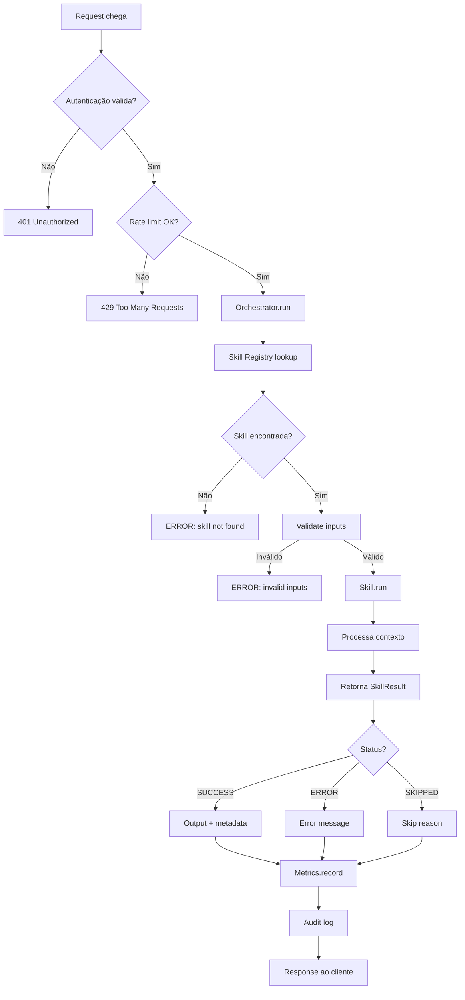
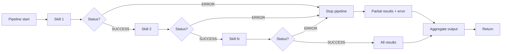
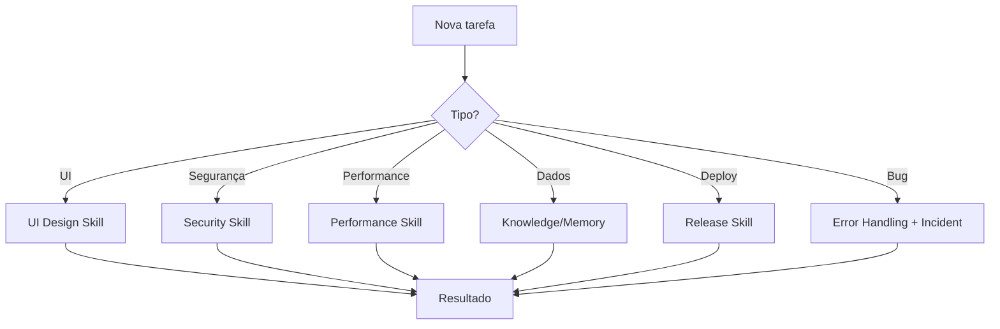
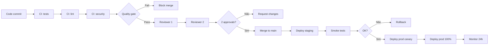
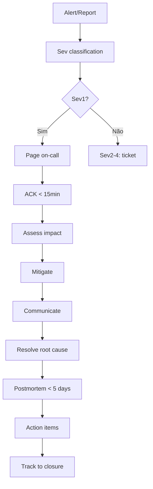

# AI-Brain-Framework — Fluxo de Execução

**Versão:** 1.0.0 | **Status:** Oficial

---

## Fluxo de Execução de uma Skill

## Fluxo de Pipeline

## Fluxo de Decisão por Domínio

## Fluxo de Release

## Fluxo de Incident Response

---

## Tabela de Decisão Rápida

| Se você precisa de... | Use a skill... |
|---|---|
| Roteamento inteligente | `brain` |
| Persistir conhecimento | `knowledge` |
| Estado entre sessões | `memory` |
| Raciocínio explícito | `reasoning` |
| Descoberta de código | `discovery` |
| Compressão de texto | `token-economy` |
| Auditoria de segurança | `security-auditor` |
| Relatório de segurança | `security-report` |
| Validação de UI | `ui-design` |
| Tratamento de erro | `error-handling` |
| Logging estruturado | `logging` |
| Cache | `caching` |
| Observabilidade | `observability` |
| Otimização de custos | `cost-optimization` |
| Resposta a incidente | `incident-response` |
| Capacity planning | `capacity-planning` |
| Chaos engineering | `chaos-engineering` |
| Feature flags | `feature-flags` |
| Secrets | `secrets-management` |
| Background jobs | `background-jobs` |
| Multi-tenancy | `multi-tenancy` |
| DB migrations | `database-migration` |
| API versioning | `api-versioning` |
| Rate limiting | `rate-limiting` |
| Implementação | `implementation` |
| Testes | `testing` |
| Release | `release` |
| Governança | `governance` |

---

**Este documento é o guia visual de execução do framework.**
