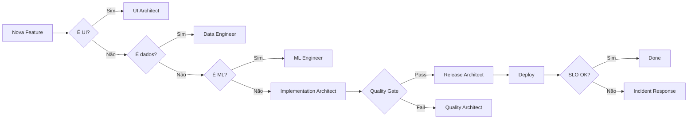

# AI-Brain-Framework — Hierarquia e Cross-References

**Versão:** 1.0.0 | **Status:** Oficial

---

## Hierarquia de Agentes

```mermaid
graph TD
    A[00 Chief Architect] --> B[01 Solution Architect]
    A --> C[02 Core Architect]
    B --> D[Engine Architects]
    C --> D
    D --> E[03 Brain]
    D --> F[04 Knowledge]
    D --> G[05 Memory]
    D --> H[06 Reasoning]
    D --> I[07 Discovery]
    D --> J[08 Index]
    D --> K[09 Graph]
    D --> L[10 Context]
    D --> M[11 Security]
    D --> N[12 Privacy]
    D --> O[13 Performance]
    D --> P[14 Database]
    D --> Q[15 API]
    D --> R[16 Documentation]
    D --> S[17 Quality]
    D --> T[18 Testing]
    D --> U[19 Governance]
    D --> V[20 Implementation]
    D --> W[21 Release]
    D --> X[22 Reviewer]
    D --> Y[23 UI]
    D --> Z[24 SRE]
    D --> AA[25 Data Engineer]
    D --> AB[26 ML Engineer]
    D --> AC[27 FinOps]
    D --> AD[28 Legal]
    D --> AE[29 Capacity]
    D --> AF[30 Platform]
    D --> AG[31 Product]
    D --> AH[32 Tech Writer]
    D --> AI[33 AI Safety]
    D --> AJ[34 Tech Lead]
    D --> AK[35 UX Researcher]
    D --> AL[36 Analyzer]
    D --> AM[37 Planner]
    D --> AN[38 Executor]
    D --> AO[39 Tester]
    X --> AP[Quality Architect]
    AP --> W
```

## Hierarquia de Skills

```mermaid
graph TD
    SC[Skills Core] --> SK[Skills Knowledge]
    SC --> SM[Skills Memory]
    SC --> SR[Skills Reasoning]
    SC --> SB[Skills Brain]
    SD[Skills Discovery] --> SI[Skills Index]
    SD --> SG[Skills Graph]
    SCX[Skills Context] --> STE[Skills Token Economy]
    SGov[Skills Governance] --> SS[Skills Security]
    SGov --> SP[Skills Privacy]
    SGov --> SQ[Skills Quality]
    SGov --> SRV[Skills Review]
    SGov --> SRL[Skills Rate Limiting]
    SE[Skills Engineering] --> SA[Skills Architecture]
    SE --> SDB[Skills Database]
    SE --> SAP[Skills API]
    SE --> SPerf[Skills Performance]
    SE --> SDoc[Skills Documentation]
    SE --> SUI[Skills UI Design]
    SE --> SSDF[Skills Secure Dev Framework]
    SE --> STEC[Skills Token Efficient Coder]
    SE --> SSA[Skills Security Auditor]
    SE --> SSR[Skills Security Report]
    SD[Skills Delivery] --> SI2[Skills Implementation]
    SD --> ST[Skills Testing]
    SD --> SR2[Skills Release]
    SD --> SGov2[Skills Governance]
    SD --> SEH[Skills Error Handling]
    SD --> SL[Skills Logging]
    SD --> SC2[Skills Caching]
    SD --> SO[Skills Observability]
    SD --> SCO[Skills Cost Optimization]
    SD --> SIR[Skills Incident Response]
    SD --> SCP[Skills Capacity Planning]
    SD --> SCE[Skills Chaos Engineering]
    SD --> SFF[Skills Feature Flags]
```

## Cross-References Principais

### Segurança
- `security-skill` ↔ `security-auditor` ↔ `security-report` ↔ `secure-dev-framework`
- `security-skill` → `privacy-skill` → `rate-limiting-skill`
- `security-skill` → `error-handling-skill` → `logging-skill`

### Performance
- `performance-skill` ↔ `caching-skill` ↔ `observability-skill`
- `performance-skill` → `capacity-planning-skill` → `cost-optimization-skill`

### Dados
- `knowledge-skill` ↔ `memory-skill` ↔ `discovery-skill` ↔ `index-skill` ↔ `graph-skill`
- `knowledge-skill` → `reasoning-skill`

### Delivery
- `implementation-skill` ↔ `testing-skill` ↔ `release-skill`
- `release-skill` → `feature-flags-skill` → `chaos-engineering-skill`
- `release-skill` → `incident-response-skill` → `chaos-engineering-skill`

### Operações
- `sre-architect` ↔ `capacity-architect` ↔ `finops-architect`
- `observability-skill` ↔ `logging-skill` ↔ `error-handling-skill`
- `incident-response-skill` ↔ `chaos-engineering-skill`

### UI/UX
- `ui-design-skill` ↔ `documentation-skill`
- `ui-design-skill` → `performance-skill` (Core Web Vitals)

---

## Workflow de Decisão

---

## Mapa de Skills por Problema

| Problema | Skills Recomendadas |
|---|---|
| Lentidão | `performance-skill` + `caching-skill` + `observability-skill` |
| Crash | `error-handling-skill` + `logging-skill` + `incident-response-skill` |
| Custo alto | `cost-optimization-skill` + `capacity-planning-skill` |
| Bug recorrente | `testing-skill` + `chaos-engineering-skill` |
| Deploy arriscado | `feature-flags-skill` + `chaos-engineering-skill` |
| LGPD | `privacy-skill` + `legal-architect` |
| Documentação fraca | `documentation-skill` + `knowledge-skill` |

---

**Este documento é a fonte oficial de navegação entre skills e agentes.**
