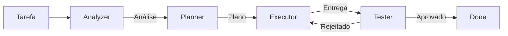
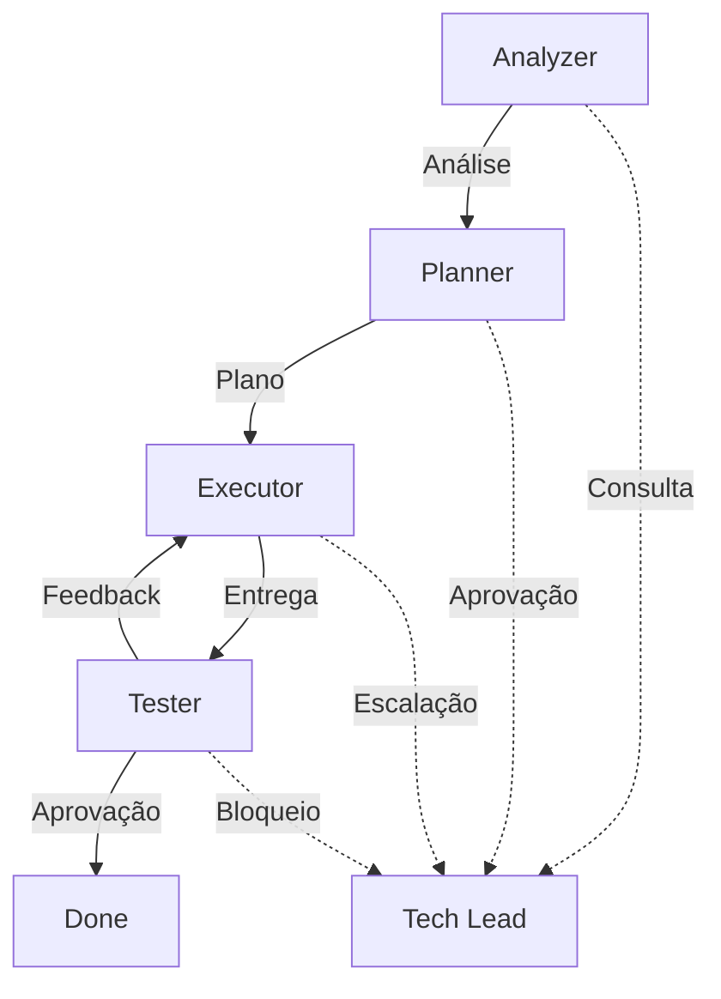

# Workflow: Analyze → Plan → Execute → Test

**Versão:** 1.0.0 | **Status:** Oficial

Workflow padrão para execução de tarefas usando os 4 agentes especializados.

---

## Fluxo



## Etapas

### 1. Analyzer (Análise)
- Extrai requisitos
- Identifica problemas
- Mapeia restrições
- Sugere abordagens

**Output:** Análise estruturada

### 2. Planner (Planejamento)
- Decompõe em tasks
- Mapeia dependências
- Estima esforço
- Define critérios de aceite

**Output:** Plano de execução

### 3. Executor (Execução)
- Implementa tasks
- Segue sequência
- Reporta progresso
- Escala bloqueios

**Output:** Código + PRs

### 4. Tester (Validação)
- Roda testes
- Valida critérios
- Documenta bugs
- Aprova ou rejeita

**Output:** Relatório de testes

---

## Exemplo Prático

```yaml
Tarefa: "Adicionar autenticação 2FA"

# 1. Analyzer
Análise:
  - Requisito: 2FA para admins
  - Restrição: LGPD
  - Risco: UX ruim se mal implementado
  - Recomendação: TOTP via app

# 2. Planner
Plano:
  - T1: Spec da feature (1h)
  - T2: Implementar TOTP (4h)
  - T3: UI de setup (2h)
  - T4: Testes (2h)
  - T5: Docs (1h)
  Total: 10h
  Dependências: T1 → T2,T3 → T4 → T5

# 3. Executor
Status:
  - T1: DONE
  - T2: IN_PROGRESS
  - T3: TODO
  - T4: BLOCKED (aguarda T2,T3)
  - T5: BLOCKED (aguarda T4)

# 4. Tester
Relatório:
  - TOTP funciona: ✅
  - QR code gerado: ✅
  - Backup codes: ✅
  - Edge cases: 2 bugs encontrados
  - Status: REJECTED → Executor corrige → RE-TEST
```

---

## Quando Usar Este Workflow

- ✅ Features novas
- ✅ Bug fixes complexos
- ✅ Refatorações grandes
- ✅ Mudanças arquiteturais

## Quando NÃO Usar

- ❌ Tasks triviais (< 30min)
- ❌ Hotfixes urgentes
- ❌ Mudanças de uma linha

Para esses casos, use o Executor diretamente.

---

## Interfaces



---

**Este workflow é o padrão recomendado para o AI-Brain-Framework.**
